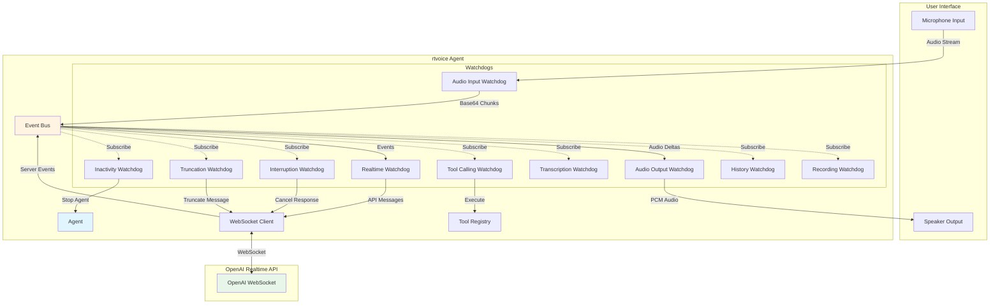
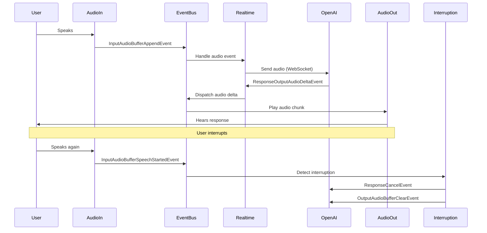

# rtvoice

A Python framework for building voice agents powered by OpenAI's Realtime API. Built with clean architecture, event-driven design, and comprehensive watchdog patterns for production-ready voice applications.

## Overview

rtvoice provides a robust foundation for creating interactive voice agents with real-time audio streaming, function calling, interruption handling, and conversation management.

### Architecture



## Features

### Core Capabilities
- ✅ **Real-time Audio Streaming**: Bidirectional audio using OpenAI's Realtime API
- ✅ **Event-Driven Architecture**: Clean separation of concerns with EventBus pattern
- ✅ **Interruption Handling**: Natural conversation flow with mid-response interruption
- ✅ **Tool Calling**: Function execution with automatic parameter validation
- ✅ **Transcription**: Optional speech-to-text for both user and assistant
- ✅ **Recording**: Full conversation recording support
- ✅ **Inactivity Timeout**: Automatic session management

### Advanced Features
- ✅ **Message Truncation**: Precise conversation state management during interruptions
- ✅ **Speech Speed Control**: Dynamic adjustment of assistant response speed
- ✅ **Volume Control**: Runtime audio output adjustment
- ✅ **Conversation History**: Complete turn-by-turn conversation tracking
- ✅ **Custom Audio Devices**: Pluggable audio input/output interfaces


### Basic Usage

```python
import asyncio
from rtvoice import Agent, Tools
from rtvoice.views import AssistantVoice, RealtimeModel

async def main():
    tools = Tools()

    @tools.action("Get weather information")
    async def get_weather(location: str) -> str:
        return f"Weather in {location}: Sunny, 22°C"

    # Initialize agent
    agent = Agent(
        instructions="You are a helpful voice assistant.",
        model=RealtimeModel.GPT_REALTIME_MINI,
        voice=AssistantVoice.MARIN,
        speech_speed=1.0,
        tools=tools,
        api_key="your-openai-api-key"
    )

    # Start conversation
    async with agent:
        # Agent runs until user says "stop" or timeout occurs
        pass

    # Get conversation history
    history = await agent.stop()
    print(f"Conversation had {len(history.conversation_turns)} turns")

if __name__ == "__main__":
    asyncio.run(main())
```

## Architecture Overview

### Event Bus Pattern
All components communicate through a central EventBus, enabling:
- **Loose coupling**: Components don't directly depend on each other
- **Easy testing**: Mock events for unit tests
- **Clear event flow**: All interactions are traceable
- **Extensible**: Add new watchdogs without modifying existing code

### Watchdog Pattern
Specialized watchdogs monitor and react to specific events:

| Watchdog | Responsibility |
|----------|---------------|
| **AudioInputWatchdog** | Streams microphone audio to the API |
| **AudioOutputWatchdog** | Plays assistant audio responses |
| **LifecycleWatchdog** | Manages WebSocket communication with OpenAI |
| **InterruptionWatchdog** | Handles user interruptions during responses |
| **TruncationWatchdog** | Manages conversation state during interruptions |
| **ToolCallingWatchdog** | Executes function calls from the assistant |
| **TranscriptionWatchdog** | Tracks speech-to-text output |
| **TimeoutWatchdog** | Monitors user inactivity and triggers shutdown |
| **HistoryWatchdog** | Maintains conversation turn history |
| **RecordingWatchdog** | Records full conversation audio |

### Event Flow Example



### Key Events

#### Server Events (from OpenAI)
```python
ResponseCreatedEvent                    # Assistant starts responding
ResponseOutputAudioDeltaEvent          # Audio chunk received
ResponseDoneEvent                      # Response completed
InputAudioBufferSpeechStartedEvent     # User starts speaking
InputAudioBufferSpeechStoppedEvent     # User stops speaking
FunctionCallItem                       # Tool call requested
InputAudioTranscriptionCompleted       # Transcription ready
```

#### Client Events (to OpenAI)
```python
InputAudioBufferAppendEvent            # Send audio to API
ResponseCancelEvent                    # Cancel current response
ResponseCreateEvent                    # Request new response
SessionUpdateEvent                     # Update session config
ConversationItemTruncateEvent         # Truncate conversation item
```

#### Internal Events
```python
AgentStartedEvent                      # Agent initialization complete
AgentStoppedEvent                      # Agent shutdown initiated
StopAgentCommand                       # Trigger agent shutdown
UserInactivityTimeoutEvent            # Timeout occurred
```

## Built-in Tools

The framework includes several built-in tools:

```python
@tools.action("Get the current local time")
def get_current_time() -> str:
    """Returns current time in HH:MM:SS format"""

@tools.action("Adjust volume level")
async def adjust_volume(level: float) -> str:
    """Set audio output volume (0.0-1.0)"""

@tools.action("Change assistant's talking speed")
async def change_assistant_response_speed(instructions: str) -> str:
    """Adjust speech speed with 'faster' or 'slower'"""

@tools.action("Stop the assistant run")
async def stop_assistant_run() -> str:
    """End the conversation"""
```

## Custom Tools

Add your own tools easily:

```python
from typing import Annotated
from rtvoice import Tools

tools = Tools()

@tools.action("Search for information")
async def search(
    query: Annotated[str, "The search query"],
    max_results: Annotated[int, "Maximum number of results"] = 5
) -> str:
    # Your implementation
    results = await search_database(query, limit=max_results)
    return f"Found {len(results)} results"

@tools.action(
    description="Book a restaurant reservation",
    response_instruction="Confirm the booking details to the user"
)
async def book_restaurant(
    restaurant: Annotated[str, "Restaurant name"],
    time: Annotated[str, "Reservation time (HH:MM)"],
    guests: Annotated[int, "Number of guests"]
) -> str:
    # Your booking logic
    return f"Booked table for {guests} at {restaurant} for {time}"
```

## Configuration

### Agent Parameters

```python
Agent(
    instructions: str = "",                          # System prompt
    model: RealtimeModel = RealtimeModel.GPT_REALTIME_MINI,
    voice: AssistantVoice = AssistantVoice.MARIN,   # Voice selection
    speech_speed: float = 1.0,                       # 0.5 - 1.5
    transcription_model: TranscriptionModel | None = None,
    tools: Tools | None = None,
    recording_output_path: str | None = None,
    api_key: str | None = None,
    audio_input: AudioInputDevice | None = None,
    audio_output: AudioOutputDevice | None = None,
)
```

### Available Voices

- `AssistantVoice.ALLOY`
- `AssistantVoice.ECHO`
- `AssistantVoice.SHIMMER`
- `AssistantVoice.ASH`
- `AssistantVoice.BALLAD`
- `AssistantVoice.CORAL`
- `AssistantVoice.SAGE`
- `AssistantVoice.VERSE`
- `AssistantVoice.MARIN` (default)

### Available Models

- `RealtimeModel.GPT_REALTIME` - gpt-4o-realtime-preview-2024-12-17
- `RealtimeModel.GPT_REALTIME_MINI` - gpt-4o-mini-realtime-preview-2024-12-17 (default)

## Custom Audio Devices

Implement custom audio sources/outputs:

```python
from rtvoice.audio.devices import AudioInputDevice, AudioOutputDevice
from collections.abc import AsyncIterator

class CustomMicrophone(AudioInputDevice):
    async def start(self) -> None:
        # Initialize your audio source
        pass

    async def stop(self) -> None:
        # Cleanup
        pass

    async def stream_chunks(self) -> AsyncIterator[bytes]:
        while self.is_active:
            chunk = await self.read_audio()  # Your implementation
            yield chunk

    @property
    def is_active(self) -> bool:
        return self._active

class CustomSpeaker(AudioOutputDevice):
    async def start(self) -> None:
        # Initialize audio output
        pass

    async def stop(self) -> None:
        # Cleanup
        pass

    async def play_chunk(self, chunk: bytes) -> None:
        # Play audio chunk
        pass

    async def clear_buffer(self) -> None:
        # Clear any queued audio
        pass

# Use custom devices
agent = Agent(
    audio_input=CustomMicrophone(),
    audio_output=CustomSpeaker()
)
```

## Advanced Usage

### Access Event Bus

```python
agent = Agent(...)

# Subscribe to events
async def on_transcription(event):
    print(f"Transcribed: {event.transcript}")

agent.event_bus.subscribe(
    InputAudioTranscriptionCompleted,
    on_transcription
)
```

### Recording Conversations

```python
agent = Agent(
    recording_output_path="conversations/session_001.wav"
)
```

### Conversation History

```python
history = await agent.stop()

for turn in history.conversation_turns:
    print(f"{turn.role}: {turn.content}")
```

## Requirements

- Python 3.13+
- OpenAI API key with Realtime API access
- PyAudio for audio I/O
- WebSockets for API communication
- Pydantic for data validation

## Installation from Source

```bash
git clone https://github.com/yourusername/rtvoice.git
cd rtvoice
uv pip install -e .
```

## Environment Variables

```bash
# Required
OPENAI_API_KEY=your-api-key-here

# Optional
RTVOICE_LOG_LEVEL=DEBUG
```
