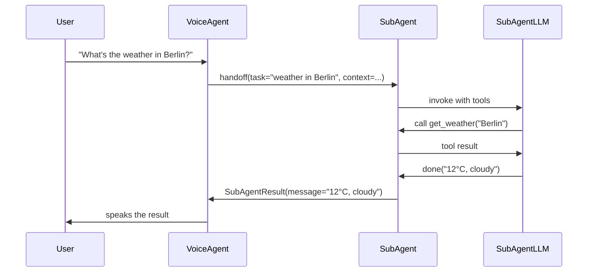
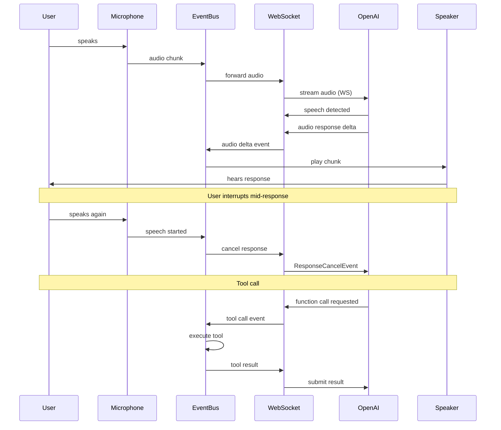

# rtvoice

A Python framework for building voice agents on top of OpenAI's Realtime API. Handles audio streaming, interruption detection, tool calling, transcription, subagents, and MCP servers — so you can focus on your application logic.

## Installation

```bash
pip install rtvoice
```

Requires Python 3.13+ and an `OPENAI_API_KEY` environment variable (or pass `api_key=` directly).

---

## Quick Start

```python
import asyncio
from rtvoice import RealtimeAgent

async def main():
    agent = RealtimeAgent(
        instructions="You are a helpful voice assistant. Answer concisely.",
    )
    await agent.run()

asyncio.run(main())
```

---

## Configuration

`RealtimeAgent` accepts the following parameters:

| Parameter | Type | Default | Description |
|---|---|---|---|
| `instructions` | `str` | `""` | System prompt for the assistant |
| `model` | `RealtimeModel` | `GPT_REALTIME_MINI` | Which Realtime model to use |
| `voice` | `AssistantVoice` | `MARIN` | Voice of the assistant |
| `speech_speed` | `float` | `1.0` | Playback speed, clamped to `0.5–1.5` |
| `transcription_model` | `TranscriptionModel \| None` | `None` | Enable speech-to-text (user + assistant) |
| `noise_reduction` | `NoiseReduction` | `FAR_FIELD` | Microphone noise reduction mode |
| `turn_detection` | `TurnDetection \| None` | defaults | VAD sensitivity settings |
| `tools` | `Tools \| None` | `None` | Callable tools the assistant can invoke |
| `subagents` | `list[SubAgent] \| None` | `None` | Specialist agents to delegate tasks to |
| `mcp_servers` | `list[MCPServer] \| None` | `None` | MCP servers to connect to |
| `audio_input` | `AudioInputDevice \| None` | `MicrophoneInput()` | Custom audio source |
| `audio_output` | `AudioOutputDevice \| None` | `SpeakerOutput()` | Custom audio sink |
| `transcript_listener` | `TranscriptListener \| None` | `None` | Callbacks for transcript events |
| `agent_listener` | `AgentListener \| None` | `None` | Callbacks for lifecycle events |
| `inactivity_timeout_seconds` | `float` | `10.0` | Auto-stop after this many seconds of silence |
| `api_key` | `str \| None` | `None` | OpenAI API key (falls back to env var) |

### Models & Voices

```python
from rtvoice.views import RealtimeModel, AssistantVoice

# Models
RealtimeModel.GPT_REALTIME       # gpt-realtime
RealtimeModel.GPT_REALTIME_MINI  # gpt-realtime-mini (default)

# Voices
AssistantVoice.MARIN    # default
AssistantVoice.ALLOY
AssistantVoice.ASH
AssistantVoice.CORAL
AssistantVoice.ECHO
AssistantVoice.NOVA
AssistantVoice.SAGE
AssistantVoice.SHIMMER
# ... and more
```

### Turn Detection

```python
from rtvoice.views import TurnDetection

agent = RealtimeAgent(
    instructions="...",
    turn_detection=TurnDetection(
        threshold=0.5,              # VAD sensitivity (0.0–1.0)
        prefix_padding_ms=300,      # Audio included before speech onset
        silence_duration_ms=500,    # Silence needed to end a turn
    ),
)
```

---

## Tools

Tools are Python functions decorated with `@tools.action(...)`. The assistant can call them during a conversation. Both sync and async functions are supported.

```python
import asyncio
from typing import Annotated
from rtvoice import RealtimeAgent, Tools

tools = Tools()

@tools.action("Look up the current weather for a city.")
async def get_weather(
    city: Annotated[str, "The city to get weather for."],
) -> str:
    return f"Weather in {city}: 18°C, partly cloudy."

@tools.action("Send an email to a recipient.")
async def send_email(
    recipient: Annotated[str, "Email address."],
    subject: Annotated[str, "Email subject."],
    body: Annotated[str, "Email body."],
) -> str:
    # ... your email logic
    return f"Email sent to {recipient}."

agent = RealtimeAgent(
    instructions="You are a helpful assistant. You can check weather and send emails.",
    tools=tools,
)

asyncio.run(agent.run())
```

### Injected Parameters

Tools can declare special parameters that are automatically injected by the framework — no need to pass them from the LLM:

| Parameter name | Type | Description |
|---|---|---|
| `event_bus` | `EventBus` | The agent's internal event bus |
| `context` | `T` | Custom context object passed to `RealtimeAgent(context=...)` |
| `conversation_history` | `ConversationHistory` | Full conversation history so far |

```python
from rtvoice.conversation import ConversationHistory

@tools.action("Summarize the conversation so far.")
async def summarize(conversation_history: ConversationHistory) -> str:
    return conversation_history.format()
```

---

## Transcript Listener

Implement `TranscriptListener` to react to completed speech turns. Requires `transcription_model` to be set for user transcription.

```python
from rtvoice import RealtimeAgent
from rtvoice.views import TranscriptionModel, TranscriptListener

class ConsolePrinter(TranscriptListener):
    async def on_user_completed(self, transcript: str) -> None:
        print(f"User: {transcript}")

    async def on_assistant_completed(self, transcript: str) -> None:
        print(f"Assistant: {transcript}")

agent = RealtimeAgent(
    instructions="...",
    transcription_model=TranscriptionModel.WHISPER_1,
    transcript_listener=ConsolePrinter(),
)
```

Both callbacks are optional — override only what you need.

---

## Agent Listener

`AgentListener` provides hooks into the agent's lifecycle. Useful for logging, metrics, or UI state.

```python
from rtvoice import RealtimeAgent
from rtvoice.views import AgentListener

class MyListener(AgentListener):
    async def on_agent_started(self) -> None:
        """Called when the WebSocket session is established and the agent is ready."""
        print("Ready.")

    async def on_agent_stopped(self) -> None:
        """Called when the agent shuts down cleanly."""
        print("Stopped.")

    async def on_agent_interrupted(self) -> None:
        """Called when the assistant is interrupted mid-response by the user."""
        print("Interrupted.")

    async def on_subagent_called(self, agent_name: str, task: str) -> None:
        """Called when a subagent is dispatched with a task."""
        print(f"→ {agent_name}: {task}")

    async def on_agent_error(self, type: str, message: str, code: str | None, param: str | None) -> None:
        """Called on API-level errors."""
        print(f"Error [{code}]: {message}")

agent = RealtimeAgent(
    instructions="...",
    agent_listener=MyListener(),
)
```

---

## SubAgents

SubAgents let the main voice agent delegate specialized tasks to dedicated LLM agents. The main agent sees them as regular tools and decides autonomously when to call them.

```python
import asyncio
from typing import Annotated
from llmify import ChatOpenAI
from rtvoice import RealtimeAgent, SubAgent, Tools

# 1. Build tools for the subagent
tools = Tools()

@tools.action("Fetch the current weather for a city.")
def get_weather(city: Annotated[str, "The city name."]) -> str:
    return f"Weather in {city}: 12°C, cloudy."

# 2. Define the subagent
weather_agent = SubAgent(
    name="Weather Assistant",
    description=(
        "Looks up current weather conditions for any city. "
        "Use this whenever the user asks about weather or temperature."
    ),
    instructions="You are a weather assistant. Use the get_weather tool and answer concisely.",
    llm=ChatOpenAI(model="gpt-4o-mini"),
    tools=tools,
)

# 3. Attach to the main agent
agent = RealtimeAgent(
    instructions="You are a voice assistant. For weather questions, delegate to the Weather Assistant.",
    subagents=[weather_agent],
)

asyncio.run(agent.run())
```

### SubAgent Options

| Parameter | Description |
|---|---|
| `name` | Identifier shown to the main agent as the tool name |
| `description` | Tells the main agent *when* to call this subagent |
| `instructions` | System prompt for the subagent's own LLM |
| `llm` | The `BaseChatModel` to use (e.g. `ChatOpenAI`) |
| `tools` | Tools available to the subagent |
| `mcp_servers` | MCP servers to attach to the subagent |
| `max_iterations` | Maximum LLM turns before giving up (default: `10`) |
| `handoff_instructions` | Extra instructions appended to `description` — guides the main agent on *how* to hand off |
| `result_instructions` | Text the main agent receives immediately, before the subagent finishes (useful with `fire_and_forget`) |
| `fire_and_forget` | If `True`, the main agent continues immediately without waiting for the result |

### How SubAgents Work

When the main voice agent decides to call a subagent, the framework:

1. Dispatches a `SubAgentCalledEvent` (triggers `on_subagent_called` on your listener)
2. Passes the current conversation history as context
3. Runs the subagent's internal ReAct loop (tool calls → LLM → tool calls …)
4. Returns the final result back to the main voice agent as a tool result


```mermaid
sequenceDiagram
    participant User
    participant VoiceAgent
    participant SubAgent
    participant SubAgentLLM

    User->>VoiceAgent: "What's the weather in Berlin?"
    VoiceAgent->>SubAgent: handoff(task="weather in Berlin", context=...)
    SubAgent->>SubAgentLLM: invoke with tools
    SubAgentLLM->>SubAgent: call get_weather("Berlin")
    SubAgent->>SubAgentLLM: tool result
    SubAgentLLM->>SubAgent: done("12°C, cloudy")
    SubAgent->>VoiceAgent: SubAgentResult(message="12°C, cloudy")
    VoiceAgent->>User: speaks the result
```

### Fire & Forget

For long-running tasks (e.g. sending an email), use `fire_and_forget=True`. The main agent gets back `result_instructions` immediately and the subagent runs in the background.

```python
email_agent = SubAgent(
    name="email_agent",
    description="Sends an email. Use when the user wants to send an email.",
    instructions="You are an email assistant. Send the email and confirm.",
    llm=ChatOpenAI(model="gpt-4o-mini"),
    tools=email_tools,
    fire_and_forget=True,
    result_instructions="The email is being sent in the background.",
)
```

---

## MCP Servers

Connect any MCP-compatible tool server to the agent or to individual subagents.

```python
from rtvoice import RealtimeAgent
from rtvoice.mcp import MCPServerStdio

agent = RealtimeAgent(
    instructions="...",
    mcp_servers=[
        MCPServerStdio(
            command="python",
            args=["my_mcp_server.py"],
        )
    ],
)
```

`MCPServerStdio` spawns a subprocess and communicates over stdin/stdout using the MCP protocol. All tools exposed by the server are automatically registered and made available to the LLM.

---

## Event Flow


```mermaid
sequenceDiagram
    participant User
    participant Microphone
    participant EventBus
    participant WebSocket
    participant OpenAI
    participant Speaker

    User->>Microphone: speaks
    Microphone->>EventBus: audio chunk
    EventBus->>WebSocket: forward audio
    WebSocket->>OpenAI: stream audio (WS)

    OpenAI->>WebSocket: speech detected
    OpenAI->>WebSocket: audio response delta
    WebSocket->>EventBus: audio delta event
    EventBus->>Speaker: play chunk
    Speaker->>User: hears response

    Note over User,Speaker: User interrupts mid-response
    User->>Microphone: speaks again
    Microphone->>EventBus: speech started
    EventBus->>WebSocket: cancel response
    WebSocket->>OpenAI: ResponseCancelEvent

    Note over User,Speaker: Tool call
    OpenAI->>WebSocket: function call requested
    WebSocket->>EventBus: tool call event
    EventBus->>EventBus: execute tool
    EventBus->>WebSocket: tool result
    WebSocket->>OpenAI: submit result
```

---

## Custom Audio Devices

Implement `AudioInputDevice` or `AudioOutputDevice` to use any audio source or sink — useful for testing, embedded hardware, or telephony integrations.

```python
from collections.abc import AsyncIterator
from rtvoice.audio.devices import AudioInputDevice, AudioOutputDevice

class CustomMicrophone(AudioInputDevice):
    async def start(self) -> None: ...
    async def stop(self) -> None: ...

    async def stream_chunks(self) -> AsyncIterator[bytes]:
        while self.is_active:
            yield await self._read_audio_chunk()

    @property
    def is_active(self) -> bool:
        return self._active

class CustomSpeaker(AudioOutputDevice):
    async def start(self) -> None: ...
    async def stop(self) -> None: ...
    async def play_chunk(self, chunk: bytes) -> None: ...
    async def clear_buffer(self) -> None: ...

    @property
    def is_playing(self) -> bool:
        return self._playing

agent = RealtimeAgent(
    instructions="...",
    audio_input=CustomMicrophone(),
    audio_output=CustomSpeaker(),
)
```

---

## Requirements

- Python 3.13+
- OpenAI API key with Realtime API access (`OPENAI_API_KEY` env var)
